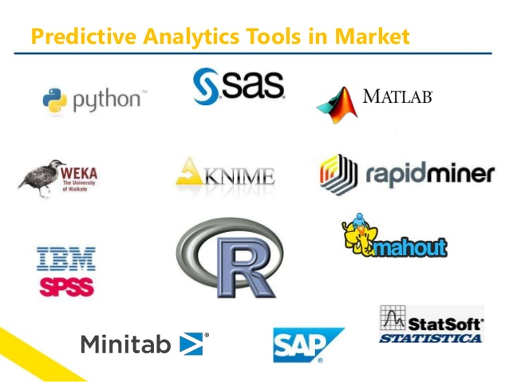
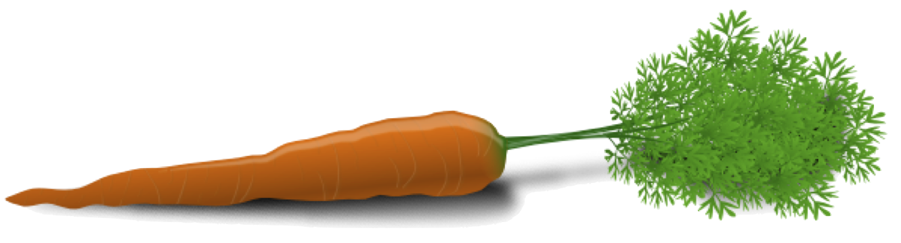
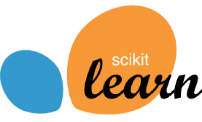

## Methodology

<!-- .element: class="plain"  -->

--!
###Data Extraction

**May represent up to 80% of the time spent in the project**

- Heterogeneous Data sources (DB, text files, xls, API, ...)
- Internal and external data sources
- Structured / Unstructured
- Stream Data

--!
###Data Exploration

**Descriptive analysis**

  

    
    
 Scatterplot and smoothing 

  

  

    
    
 Density plot 

  

--!
###Data Preparation

- Imputation policies (NaN / Empty data)
- Near-zero variance detection
- Remove correlated variables
- Transformation (distribution)
- ...

--!
<!-- .slide: data-transition="zoom" data-background="#e29191" -->
Why would I use Principal Components Analysis or Multiple Correspondence Analysis?

<iframe src="//giphy.com/embed/l4hmWKVDDUpiq355K" width="480" height="270" frameBorder="0" class="giphy-embed" allowFullScreen></iframe>

--!
<!-- .slide: data-transition="zoom" data-background="#91d87b" -->

####To reduce the dimension of the problem!

--!
###Enrichment

- Additive/Multiplicative/Polynomial variables combination
- Lag variables
- Aggregated variables (mean,sum,max,...)

--!
###Modelling

See [previous section](../#/3)

--!
###Data Validation (Regression)

- Coefficient of determination (R^2)
- Root Mean Squared Error (RMSE)
- Mean Absolute Error (MAE)
- Mean Absolute Percentage Error (MAPE)  

<!-- .element: class="plain" width="45%"  -->

--!
###Data Validation (Classification 1/4)

--!
###Data Validation (Classification 2/4)
####[Measures](https://blogs.msdn.microsoft.com/andreasderuiter/2015/02/09/performance-measures-in-azure-ml-accuracy-precision-recall-and-f1-score/)
- *Accuracy*: (True Positives + True Negatives)/Total
- *Precision*: True Positives / (True Positives + False Positives)
- *Recall*: True Positives / (True Positives + False Negatives)
- *F1 score*: 2 (precision \* recall) / (precision + recall)
--!
###Data Validation (Classification 3/4)

AUC / ROC Curve  
<!-- .element: class="plain" width="60%"  -->

--!
###Data Validation (Classification 4/4)

Gain/Lift Chart  
<!-- .element: class="plain" width="60%"  -->

--!
###Distribution / Industrialization

####Results are
- Reports
- Static Dashboard
- Dynamic Dashboard
***
####Served with
- Pdf, Email
- Desktop Application
- **WebApps** [interactive]

---
## Data Science Tools
(Non exhaustive -- missing at least [DSS](https://www.dataiku.com/dss/))  
<a href="http://www.slideshare.net/machinepulse/predictive-analytics-an-overview" rel="market"><!-- .element:width="60%"  --></a>

---
## Data Science Languages
(Non exhaustive)  

  

    <a href="https://www.r-project.org/" rel="r"><!-- .element: class="plain" width="60%"  --></a>
  

  

    <a href="https://www.python.org/" rel="python"><!-- .element: class="plain" width="60%"  --></a>
  

  

    <a href="http://www.scala-lang.org/" rel="scala"><!-- .element: class="plain" width="80%"  --></a>
  

  

    <a href="http://www.w3schools.com/js/" rel="javascript"><!-- .element: class="plain" width="80%"  --></a>
  

---
## Data Science Libraries
(Non exhaustive)  

  

    <a href="http://topepo.github.io/caret/" rel="caret"><!-- .element: class="plain" width="100%"  --></a>
  

  

    <a href="http://scikit-learn.org/stable/index.html" rel="scikit"><!-- .element: class="plain" width="80%"  --></a>
  

  

    <a href="http://spark.apache.org/" rel="spark"><!-- .element: class="plain" width="80%"  --></a>
  

  

    <a href="https://www.tensorflow.org/" rel="tensorflow"><!-- .element: class="plain" width="80%"  --></a>
  

  

    <a href="https://d3js.org/" rel="d3js"><!-- .element: class="plain" width="80%"  --></a>
  

