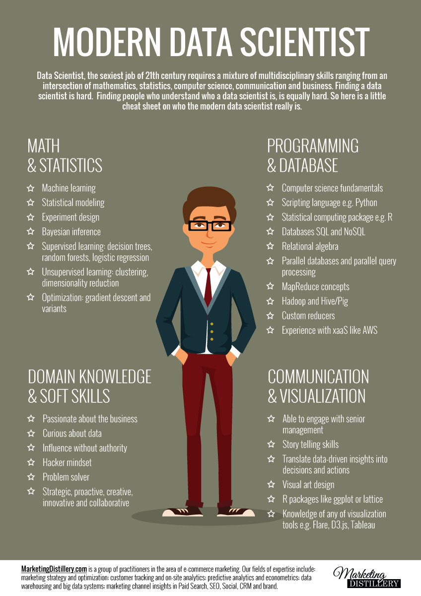

## Finally, if you're interested...
...**in being a Data Scientist**  

<!-- .slide: data-transition="zoom"  data-background="#e29191" -->
You shouldn't look like this


---
<!-- .slide: data-transition="zoom" data-background="#91d87b" -->

but rather like this!

<!-- .element: width="45%" -->  


---
#### And to do so...

***Keep learning !***  

<a href="https://www.amazon.fr/Data-science-fondamentaux-Machine-learning/dp/2212142439/ref=sr_1_1?ie=UTF8&qid=1478818462&sr=8-1&keywords=data+science" rel="BiernatLutz2015"><!-- .element: width="25%" --></a>
<a href="http://appliedpredictivemodeling.com/" rel="KuhnJohnson2013"><!-- .element: width="19%" --></a>
<a href="https://www.amazon.com/gp/product/0387848576/ref=pd_sbs_14_t_0?ie=UTF8&psc=1&refRID=NB3N8S06EBXQQGREN02C" rel="Hastie2009"><!-- .element: width="20%" --></a>  


---

##The End!

```
> print(theEnd)
[1] "That's all Folks!"
```
