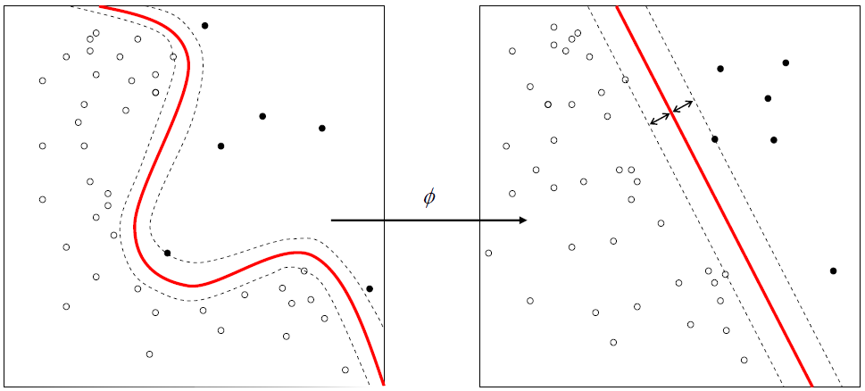
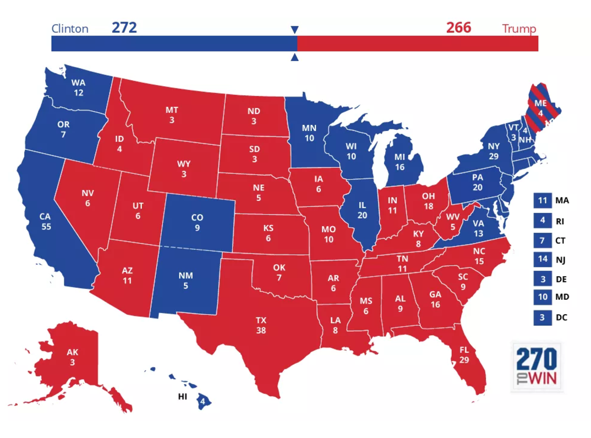
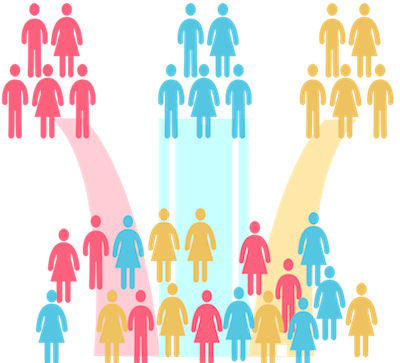
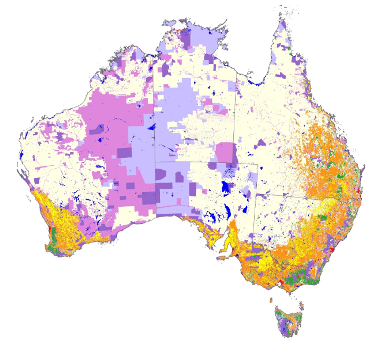
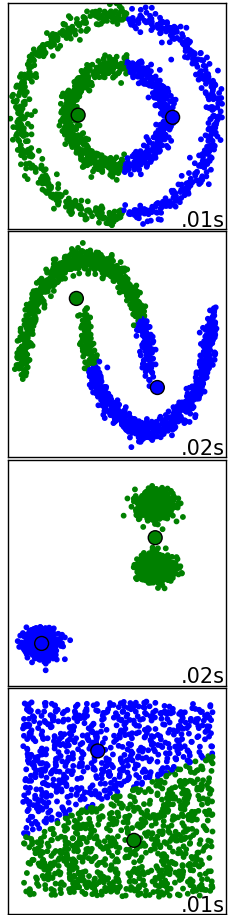
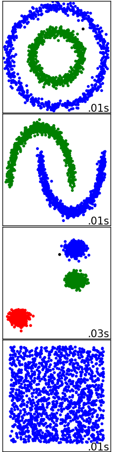
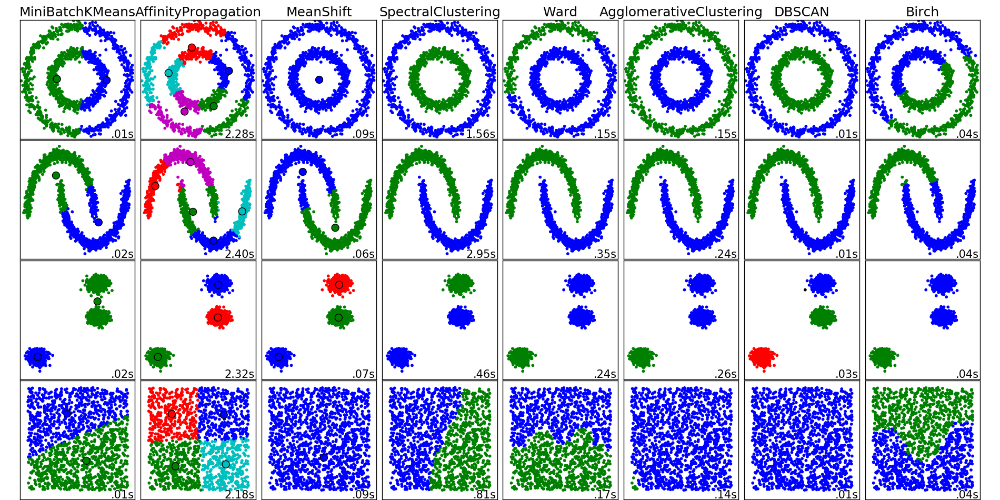
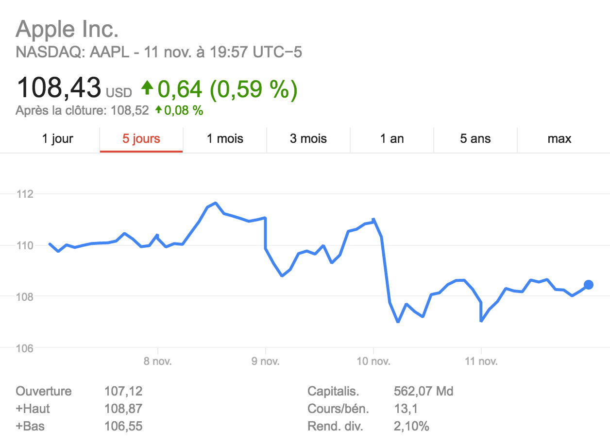
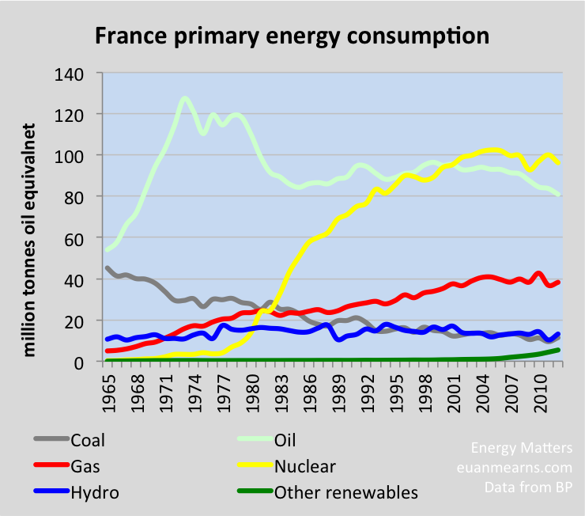

## Few Examples

####Classification

  

    
    
 Spam detection 

  

  

    
    
 Image recognition 

  

  

    
    
 Churner detection 

  

--!
####Algorithms you already know?

- Naives Bayes
- K-nearest Neighbors
- Decision trees
- Neural network
- ...

**Let's have a look to others**  <!-- .element: class="fragment" -->

--!
####Support Vector Machines (1/2)

<a href="https://en.wikipedia.org/wiki/Support_vector_machine" rel="svm_wikipedia"><!-- .element: class="plain" width="50%" --></a>

 Margins 

--!
####Support Vector Machines (2/2)

<a href="https://en.wikipedia.org/wiki/Support_vector_machine" rel="svm_wikipedia"><!-- .element: class="plain" width="90%" --></a>

 Kernels 

--!
####Deep Learning (1/3)
<!-- .element: class="plain" width="90%" -->

--!
####Deep Learning (2/3)

  

    
 Classic Neural Network 

    
  

  

    
 Convolutional Neural Network 

    
  

--!
####Deep Learning (3/3)

 Typical convnet example 

--!
####Regression

  

    
    
 Election forecast 

  

  

    
    
 Sport odds/scores 

  

--!
####Algorithms you already know?

- Linear Regression
- Polynomial Regression
- Neural networks
- Decision trees

--!
####Clustering

  

    
    
 Customers segmentation 

  

  

    
    
 Land use 

  

--!
####Few Algorithms?

  

    
    
<small>Kmeans</small>

  

  

    
    
<small>DBSCAN</small>

  

--!
####Few Algorithms?

--!
####Time series

  

    
    
 Stock forecast 

  

  

    
    
 Electricity consumption 

  

--!
**Classic approaches**
- Signal decomposition
- Exponential Smoothing
- ARIMA models
***

**Machine learning approaches**
- Autoregressive neural network
- Autoregressive random forests
- ...

--!
####(Simple) Exponential Smoothing

<!-- .element: class="plain"  -->

--!
####ARIMA

--!
####Autoregressive Neural network
