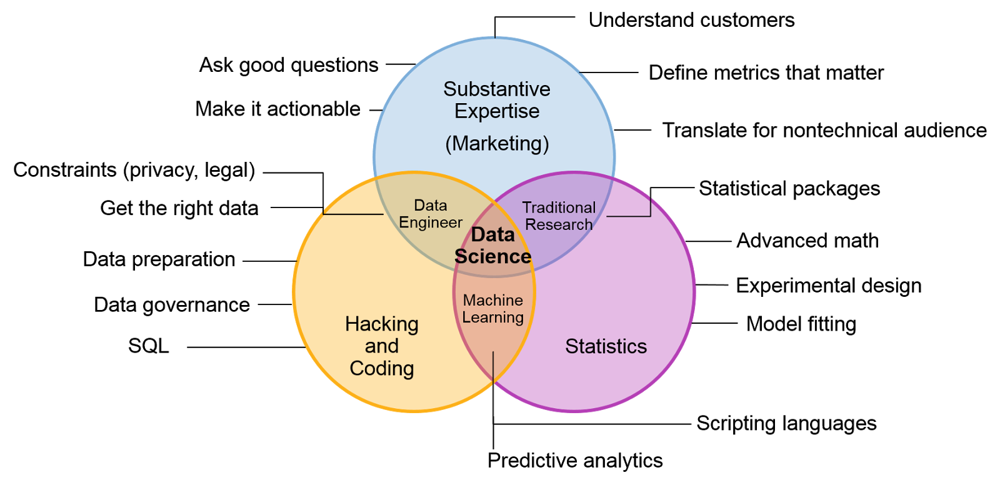

## An introduction to

# Data science
Romain Chailan

<small>[romain.chailan@twinsol.com](romain.chailan@twinsol.com)</small>  
<a href="https://fr.linkedin.com/in/romain-chailan-24246140" rel="rc linkedin"><!-- .element: class="plain" width="40px" -->
<a href="https://twitter.com/RomChailan" rel="rc twitter"><!-- .element: class="plain" width="40px" -->
<a href="https://github.com/rc-34" rel="rc githublogo"><!-- .element: class="plain" width="40px" -->
<a href="https://www.researchgate.net/profile/Romain_Chailan" rel="rc researchgate"><!-- .element: class="plain" width="40px" -->  

---

<!-- .slide: class="two-floating-elements" -->
## Who am I ?

- Polytech Montpellier (Like you!)
- Cranfield (MSc)
- PhD CIFRE (IBM France / UM)
- Hired as Data Scientist\*   
at **[Twin Solutions](http://www.twinsol.com/)**

---
## Data science

is related to  ???  
- Data Mining , Machine Learning , Predictive Analysis, Data visualization, ...

<!-- .element: class="fragment" -->

<iframe src="//giphy.com/embed/glmRyiSI3v5E4" width="480" height="353" frameBorder="0" class="giphy-embed" allowFullScreen></iframe>

[Check the debate on Quora](https://www.quora.com/Whats-the-relationship-between-machine-learning-and-data-mining)

--!
## Data science

<small>*by* [Christi Eubanks](http://blogs.gartner.com/christi-eubanks/three-lessons-crossfit-taught-data-science/)</small>

--!
## Data science
####To address
  - Classification
  - Regression
  - Clustering
  - Pattern recognition
  - Time Series
  - ...  

####with
  - Statistical Analysis
  - Machine learning and Artificial Intelligence
  - Visual Analytics (and data analytics)
  - ...
