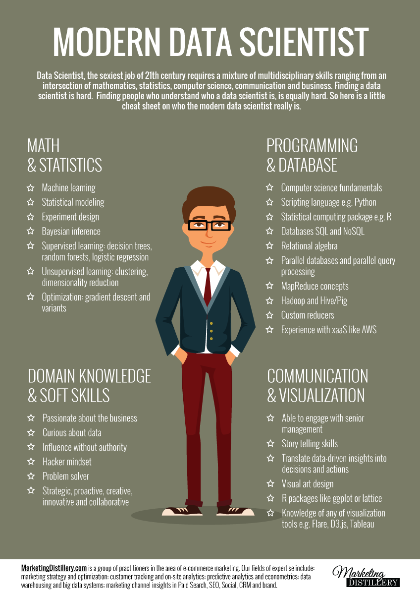

## An introduction to

# Data science
Romain Chailan

<small>[romain.chailan@twinsol.com](romain.chailan@twinsol.com)</small>  
<a href="https://fr.linkedin.com/in/romain-chailan-24246140" rel="rc linkedin"><!-- .element: class="plain" width="40px" -->
<a href="https://twitter.com/RomChailan" rel="rc twitter"><!-- .element: class="plain" width="40px" -->
<a href="https://github.com/rc-34" rel="rc githublogo"><!-- .element: class="plain" width="40px" -->
<a href="https://twitter.com/RomChailan" rel="rc researchgate"><!-- .element: class="plain" width="40px" -->  

---

<!-- .slide: class="two-floating-elements" -->
## Who am I ?


- Polytech Montpellier (Like you!)
- Cranfield (MSc)
- PhD CIFRE (IBM France / UM)
- Hired as Data Scientist\*   
at **[Twin Solutions](http://www.twinsol.com/)**

---
## Data science

is related to  
- Data Mining , Machine Learning , Predictive Analysis, Data visualization, ...

<!-- .element: class="fragment" -->

<iframe class=fragment src="//giphy.com/embed/glmRyiSI3v5E4" width="480" height="353" frameBorder="0" class="giphy-embed" allowFullScreen></iframe><p class="fragment"><a href="http://giphy.com/gifs/glmRyiSI3v5E4"></a>
[Check the debate on Quora](https://www.quora.com/Whats-the-relationship-between-machine-learning-and-data-mining)
</p>


<!-- .element: class="fragment" -->


<!-- - A rebranding of Data mining?
- Encompass  
    - Classification
    - Regression
    - Time Series Analysis
    - Deep learning
    - Association rules
    - Patterns recognition
    - ... -->

---
## Finally, if you're interested
<!-- .slide: data-background="#e29191" -->
You shouldn't look like this


---
<!-- .slide: data-transition="zoom" data-background="#91d87b" -->

but rather like this!

<!-- .element: width="45%" -->  


---

##The End!

```
> print(theEnd)
[1] "That's all Folks!"
```
